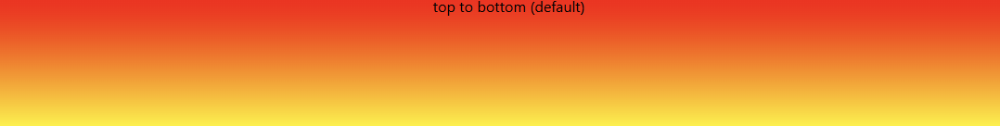
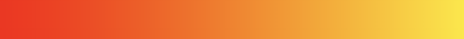
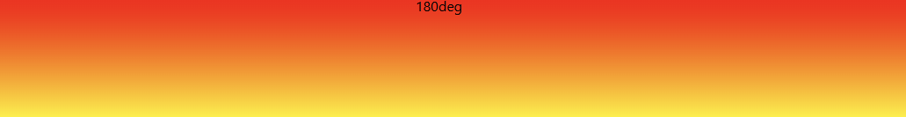
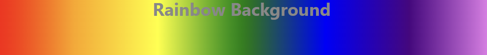
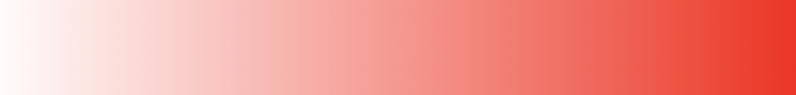
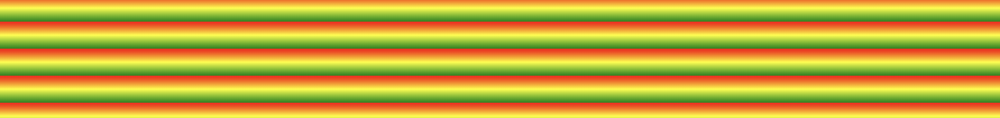

Gradient trong CSS là cách để tạo màu chuyển tiếp (chuyển sắc) mượt mà giữa nhiều màu khác nhau, thay vì chỉ dùng một màu đơn. Có **3 loại gradient chính** trong CSS:

---

## 🔹 1. **Linear Gradient (gradient tuyến tính)**

Màu chuyển tiếp theo một đường thẳng (ngang, dọc hoặc chéo).

Cú pháp:

```css
background: linear-gradient(direction, color1, color2, ...);
```

Ví dụ:

```css
/* Chuyển từ xanh sang đỏ theo chiều ngang */
background: linear-gradient(to right, blue, red);

/* Chuyển từ trên xuống dưới với nhiều màu */
background: linear-gradient(to bottom, #ff0000, #00ff00, #0000ff);

/* Chuyển theo góc 45 độ */
background: linear-gradient(45deg, purple, orange);
```

---

## 🔹 2. **Radial Gradient (gradient hình tròn / bầu dục)**

Màu tỏa ra từ tâm theo hình tròn hoặc elip.

Cú pháp:

```css
background: radial-gradient(shape size at position, color1, color2, ...);
```

Ví dụ:

```css
/* Gradient tròn từ giữa ra ngoài */
background: radial-gradient(circle, yellow, red);

/* Gradient elip từ góc trái trên */
background: radial-gradient(ellipse at top left, #00f, #0ff, #fff);
```

---

## 🔹 3. **Conic Gradient (gradient hình nón)**

Màu xoay quanh một điểm (giống như bánh xe màu).

Cú pháp:

```css
background: conic-gradient(from angle at position, color1, color2, ...);
```

Ví dụ:

```css
/* Vòng tròn nhiều màu */
background: conic-gradient(red, yellow, green, blue, red);

/* Bắt đầu từ 90 độ ở giữa */
background: conic-gradient(from 90deg at 50% 50%, pink, purple, cyan);
```

---

## 🔹 4. **Thêm độ trong suốt (alpha)**

Bạn có thể dùng `rgba()` hoặc `hsla()` để tạo hiệu ứng trong suốt:

```css
background: linear-gradient(to right, rgba(255,0,0,0.8), rgba(0,0,255,0.2));
```

---

## 🔹 5. **Kết hợp với background-image**

Gradient được xem như một loại ảnh nền, nên bạn có thể chồng lên ảnh:

```css
background: linear-gradient(rgba(0,0,0,0.5), rgba(0,0,0,0.5)), 
            url('image.jpg');
background-size: cover;
```
---

``` background-image: linear-gradient(red, yellow);```



```background-image: linear-gradient(to right, red , yellow);```



``` background-image: linear-gradient(to bottom right, red, yellow); ```


``` background-image: linear-gradient(180deg, red, yellow); ```



``` background-image: linear-gradient(to right, red, orange,yellow,green,blue,indigo,violet); ```



``` background-image: linear-gradient(to right, rgba(255,0,0,0), rgba(255,0,0,1)); ```


``` background-image: repeating-linear-gradient(red, yellow 10%, green 20%);```

